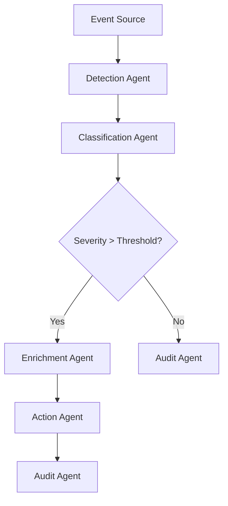

# Automated Detection Pipelines – Agentic AI Program

An end‑to‑end agentic AI framework for automated detection, triage, and enrichment across cybersecurity, compliance, and operational workflows. Built by **Shield Protocol LLC** to demonstrate modern autonomous pipeline design using multi‑agent orchestration, LLM reasoning, and event‑driven automation.

---

##  Overview

This project showcases how agentic AI systems can be used to:

- Detect anomalies or events  
- Trigger autonomous reasoning agents  
- Enrich data using external tools  
- Generate structured outputs (JSON, fragments, compliance evidence)  
- Route decisions to downstream systems (SIEM, SOAR, ticketing, SSP engines)

The pipelines are modular, cloud‑agnostic, and designed for real‑world enterprise use.

---

##  Architecture

### Agent Types

- **Detection Agent** – Monitors incoming events/logs  
- **Classification Agent** – Determines severity, category, and required action  
- **Enrichment Agent** – Pulls additional context (threat intel, compliance mappings)  
- **Action Agent** – Executes automated workflows (alerts, fragments, tickets)  
- **Audit Agent** – Writes structured evidence for RMF/CMMC  

---


##  Pipeline Flow


---
```
agentic-ai-detection-pipelines/
│
├── pipelines/
│   ├── detection_pipeline.py
│   ├── enrichment_pipeline.py
│   ├── classification_pipeline.py
│   └── action_pipeline.py
│
├── agents/
│   ├── detection_agent.py
│   ├── classification_agent.py
│   ├── enrichment_agent.py
│   ├── action_agent.py
│   └── audit_agent.py
│
├── examples/
│   ├── dod_safe_email_detection.json
│   ├── cmmc_control_mapping.json
│   └── anomaly_event_sample.json
│
├── docs/
│   ├── architecture.md
│   ├── agent_design.md
│   └── pipeline_flow.md
│
└── README.md
```
---

# agents/detection_agent.py
---
```import json

class DetectionAgent:
    def __init__(self):
        pass

    def detect(self, event):
        """Basic detection logic for incoming events."""
        if "dod_safe" in event.get("source", "").lower():
            return {
                "type": "dod_safe_event",
                "status": "detected",
                "details": event
            }
        if event.get("anomaly_score", 0) > 0.7:
            return {
                "type": "anomaly",
                "status": "detected",
                "details": event
            }
        return {"status": "ignored"}
```
# pipelines/detection_pipeline.py
---
``` from agents.detection_agent import DetectionAgent
from agents.classification_agent import ClassificationAgent
from agents.enrichment_agent import EnrichmentAgent
from agents.action_agent import ActionAgent
from agents.audit_agent import AuditAgent

class DetectionPipeline:
    def __init__(self):
        self.detect_agent = DetectionAgent()
        self.classify_agent = ClassificationAgent()
        self.enrich_agent = EnrichmentAgent()
        self.action_agent = ActionAgent()
        self.audit_agent = AuditAgent()

    def run(self, event):
        detection = self.detect_agent.detect(event)
        classification = self.classify_agent.classify(detection)

        if classification["severity"] >= 3:
            enriched = self.enrich_agent.enrich(classification)
            action = self.action_agent.execute(enriched)
            self.audit_agent.record(action)
            return action

        self.audit_agent.record(classification)
        return classification
 ```
## Use Cases
DoD SAFE Email Detection – Automatically detect SAFE notifications and route them into compliance evidence pipelines.

CMMC/RMF Evidence Automation – Generate structured audit logs for controls like AU, IR, and CM.

Threat Detection & Triage – Autonomous anomaly detection with agentic enrichment.


##  Support the Project

If you find this repository useful, consider:

- Starring  the repo  
- Sharing it with other cybersecurity engineers  
- Using it as a foundation for your own agentic AI pipelines  

Your support helps expand the open‑source ecosystem around autonomous detection and compliance automation.

---

##  Final Notes

This repository demonstrates how agentic AI can be applied to real‑world cybersecurity and compliance workflows.  
It is designed to be clear, modular, and immediately useful — whether you’re building detection pipelines, automating evidence generation, or experimenting with multi‑agent systems.

Thanks for checking out the project.

